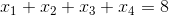

<!-- ## 字符串和常用数据结构 -->

## Strings and Common Data structures

<!-- 
### 使用字符串 -->
### The use of String

<!-- 第二次世界大战促使了现代电子计算机的诞生，当初的想法很简单，就是用计算机来计算导弹的弹道，因此在计算机刚刚诞生的那个年代，计算机处理的信息主要是数值，而世界上的第一台电子计算机ENIAC每秒钟能够完成约5000次浮点运算。随着时间的推移，虽然对数值运算仍然是计算机日常工作中最为重要的事情之一，但是今天的计算机处理得更多的数据都是以文本信息的方式存在的，而Python表示文本信息的方式我们在很早以前就说过了，那就是字符串类型。所谓**字符串**，就是由零个或多个字符组成的有限序列，一般记为。 -->

The WWII accelerated the development and creation of modern computer system. The original idea was simple, to use computers to calculate missile trajectory. Therefore, the main type of processed data in the 1900s is numbers, and the first computer ENIAC can perform 5000 floating point computations per second. Nowadays, although numerical operation is still a very important task, text is a more common data type for processing. The Python representation of text data is using Strings. A **String** data type is a sequence of 0 or more characters.  
Can be represented mathematically as :  

<!-- 我们可以通过下面的代码来了解字符串的使用。 -->

We can understand the usage of Strings through code block below:

```Python
def main():
    str1 = 'hello, world!'
    # Using len function to calculate the length of the string
    print(len(str1))  # 13
    # Capitalizing the string
    # Note that code below returns a copy of str1
    # the origin str1 is not changed
    print(str1.capitalize())  # Hello, world!
    # Transform all letters to upper case
    print(str1.upper())  # HELLO, WORLD!
    # Find the starting index of substring
    # -1 means the substring does not exist
    print(str1.find('or'))  # 8
    print(str1.find('shit'))  # -1
    # index built-in is similar with find, but throws an exception if doesn't exist
    # print(str1.index('or'))
    # print(str1.index('shit'))

    # Check if the string starts with the substring
    print(str1.startswith('He'))  # False
    print(str1.startswith('hel'))  # True
    # Check if the string ends with the substring
    print(str1.endswith('!'))  # True
    # Make string 50 characters, fill both ends with *
    # **********hello**********
    print("hello".center(25, '*'))
    # *****hello
    print("hello".rjust(10, '*'))
    str2 = 'abc123456'
    # A string can be accessed like a list
    print(str2[2])  # c
    # String list slice
    # Slice is done using the index of the list
    # a[start:stop]  # items start through stop-1
    # a[start:]      # items start through the rest of the array
    # a[:stop]       # items from the beginning through stop-1
    # a[:]           # a copy of the whole array
    print(str2[2:5])  # c12
    print(str2[2:])  # c123456
    print(str2[2::2])  # c246 print everything after index 2, step size = 2
    print(str2[::2])  # ac246
    print(str2[::-1])  # 654321cba
    print(str2[-3:-1])  # 45
    # Check if a string is only digits
    print(str2.isdigit())  # False
    # check if a string is only letter
    print(str2.isalpha())  # False
    # check if a string is alphanumerical
    print(str2.isalnum())  # True
    str3 = '  jackfrued@126.com '
    print(str3)
    # Strip returns a copy of the string without spaces at the ends
    print(str3.strip())


if __name__ == '__main__':
    main()
```
Other than Strings, Python also has a lot of built in data structures, which can be used during a program to store information. Usually, the built-ins are enough for storage, if not then you can define your own custom class. Some of the most common data structures are lists, tuples, sets, and dictionaries.

Differences between lists, tuples, sets, and dictionaries:  
- List: a simple collection of ordered objects. Can contain object of different types, including other lists and can contain duplicates. Mutable
- Set: also a collection of objects, but unordered and doesn't allow duplicates. Mutable
- Tuple: a list, but immutable. 
- Dictionary: known as hash tables in other languages. Stores key value pairs and unordered. 

Above concepts are very important for interviews, you need to know which structure is immutable and mutable. Also unordered property can come up during interviews as well. 

<!-- 除了字符串，Python还内置了多种类型的数据结构，如果要在程序中保存和操作数据，绝大多数时候可以利用现有的数据结构来实现，最常用的包括列表、元组、集合和字典。 -->

### Using a list

<!-- 下面的代码演示了如何定义列表、使用下标访问列表元素以及添加和删除元素的操作。 -->

Code below demonstrates how to define a list, accessing, inserting and deleting elements from a list. Note that index starts at 0 for any data structures in any language. So the first element is always at index 0, last index is always at len(list) - 1. 

```Python
def main():
    list1 = [1, 3, 5, 7, 100]
    print(list1)
    list2 = ['hello'] * 5
    print(list2)
    # Calculate the number of elements in a list
    print(len(list1))
    # Accessing elements based on index
    print(list1[0])
    print(list1[4])
    # IndexError: list index out of range
    # This is because since index starts at 0, there is no index 5 in the list
    print(list1[5])  
    # Negative index means starting from end
    print(list1[-1]) # print the last element
    print(list1[-3]) # print the 3rd last element
    list1[2] = 300
    print(list1)
    # appending an element to the end of the list
    list1.append(200)
    # insert(index, value)
    list1.insert(1, 400)
    list1 += [1000, 2000]
    print(list1)
    print(len(list1))
    # removing an element
    # the remove method takes in the actual value you want to delete
    list1.remove(3)
    # in and not in can be used to check if the element is contained within the list
    if 1234 in list1:
        list1.remove(1234)
    # del will delete the 0th index element
    del list1[0]
    print(list1)
    # clear a list
    list1.clear()
    print(list1)


if __name__ == '__main__':
    main()
```

Same as Strings, a list can be accessed using slice operations. 

<!-- 和字符串一样，列表也可以做切片操作，通过切片操作我们可以实现对列表的复制或者将列表中的一部分取出来创建出新的列表，代码如下所示。 -->

```Python
def main():
    fruits = ['grape', 'apple', 'strawberry', 'waxberry']
	fruits += ['pitaya', 'pear', 'mango']
	# Looping through all elements
    # title() is a built-in that returns a copy of the string with each word capitalized
    for fruit in fruits:
        print(fruit.title(), end=' ')
    print()
    # Slicing
    # This returns fruits[1] to fruits[3]
    fruits2 = fruits[1:4]
    print(fruits2)
    # fruit3 = fruits  # This does NOT make a new copy of the list. Accessing by reference
    # fruits3 is fruits => True
    # but the code below makes a copy of the fruits list
    fruits3 = fruits[:]
    # fruits3 is fruits => false
    print(fruits3)
    # Makes a copy with the 3rd last element to last element, not including last element
    fruits4 = fruits[-3:-1]
    print(fruits4)
    # Returns a copy of reversed list
    fruits5 = fruits[::-1]
    print(fruits5)


if __name__ == '__main__':
    main()
```
The code below shows how we can sort lists

```Python
def main():
    list1 = ['orange', 'apple', 'zoo', 'internationalization', 'blueberry']
    list2 = sorted(list1)
    # The sorted method returns a copy of sorted list, the original list1 is left untouched
    # When you are developing your own function, you should always try to eliminate side effects
    list3 = sorted(list1, reverse=True)
    # Can use "key" keyword to specify the criteria for sorting
    list4 = sorted(list1, key=len)
    print(list1)
    print(list2)
    print(list3)
    print(list4)
    # sort list1 and does not preserve the original list
    list1.sort(reverse=True)
    print(list1)


if __name__ == '__main__':
    main()
```

<!-- 我们还可以使用列表的生成式语法来创建列表，代码如下所示。 -->
We can also create lists using list comprehension:

```Python
import sys


def main():
    # range is not inclusive, so this produce a list from 1 to 9
    f = [x for x in range(1, 10)]
    print(f)
    f = [x + y for x in 'ABCDE' for y in '1234567']
    print(f)
    # Using list comprehension like below will create a list with all predefined elements
    # Uses large amount of memory versus creating an empty list and appending
    f = [x ** 2 for x in range(1, 1000)]
    print(sys.getsizeof(f))  # Getting the memory size of the list
    print(f)
    # Note the code below does not create a list, it creates a generator
    # The generator can only be looped through once, since it does not store all the values in memory
    # Upon each iteration, the values are generated on the fly, therefore slower run time
    f = (x ** 2 for x in range(1, 1000))
    print(sys.getsizeof(f)) 
    print(f)
    # Notice the code below cannot be ran twice
    for val in f:
        print(val)


if __name__ == '__main__':
    main()
```

The `yield` keyword can be used to return a generator inside a function. Code below shows how to create a Fibonacci's Sequence with yield. A fibonacci's sequence can be done using [recursion](https://en.wikipedia.org/wiki/Recursion_(computer_science))

<!-- 
除了上面提到的生成器语法，Python中还有另外一种定义生成器的方式，就是通过`yield`关键字将一个普通函数改造成生成器函数。下面的代码演示了如何实现一个生成[斐波拉切数列](https://zh.wikipedia.org/wiki/%E6%96%90%E6%B3%A2%E9%82%A3%E5%A5%91%E6%95%B0%E5%88%97)的生成器。所谓斐波拉切数列可以通过下面[递归](https://zh.wikipedia.org/wiki/%E9%80%92%E5%BD%92)的方法来进行定义： -->





```Python
def fib(n):
    a, b = 0, 1
    for _ in range(n):
        a, b = b, a + b
        yield a


def main():
    for val in fib(20):
        print(val)


if __name__ == '__main__':
    main()
```

> **Note：** The code above is actually not strictly recursion. It is a type of [dynamic programming](https://en.wikipedia.org/wiki/Dynamic_programming), which is a advanced computer science concept. But the simple idea is that calculating a Fibonacci's sequence using recursion creates a lot of redundant work, so it's better to save intermediate results, like the generator above. This is called [memoization](https://en.wikipedia.org/wiki/Memoization). In the dynamic programming link above, there is a Fibonacci's sequence example, which you can read. 

For more on yield, generators and iterators, read https://pythontips.com/2013/09/29/the-python-yield-keyword-explained/

### Using Tuple

<!-- Python 的元组与列表类似，不同之处在于元组的元素不能修改，在前面的代码中我们已经不止一次使用过元组了。顾名思义，我们把多个元素组合到一起就形成了一个元组，所以它和列表一样可以保存多条数据。下面的代码演示了如何定义和使用元组。 -->

Python tuples are very similar to list, but it is immutable. 

```Python
def main():
    # Defining tuple
    t = ('Author', 38, True, 'Location')
    print(t)
    # Accessing elements from tuple
    print(t[0])
    print(t[3])
    # Iterating through the tuple
    for member in t:
        print(member)
    # Trying to modify the tuple
    # t[0] = '王大锤'  # TypeError
    # Assigning a new tuple to variable t
    # This will cause the original tuple to be garbage collected
    t = ('王大锤', 20, True, '云南昆明')
    print(t)
    # Converting a tuple to list
    person = list(t)
    print(person)
    # Now we can modify the list
    person[0] = '李小龙'
    person[1] = 25
    print(person)
    # Converting a list to tuple
    fruits_list = ['apple', 'banana', 'orange']
    fruits_tuple = tuple(fruits_list)
    print(fruits_tuple)


if __name__ == '__main__':
    main()
```

<!-- 这里有一个非常值得探讨的问题，我们已经有了列表这种数据结构，为什么还需要元组这样的类型呢？

1. 元组中的元素是无法修改的，事实上我们在项目中尤其是[多线程](https://zh.wikipedia.org/zh-hans/%E5%A4%9A%E7%BA%BF%E7%A8%8B)环境（后面会讲到）中可能更喜欢使用的是那些不变对象（一方面因为对象状态不能修改，所以可以避免由此引起的不必要的程序错误，简单的说就是一个不变的对象要比可变的对象更加容易维护；另一方面因为没有任何一个线程能够修改不变对象的内部状态，一个不变对象自动就是线程安全的，这样就可以省掉处理同步化的开销。一个不变对象可以方便的被共享访问）。所以结论就是：如果不需要对元素进行添加、删除、修改的时候，可以考虑使用元组，当然如果一个方法要返回多个值，使用元组也是不错的选择。
2. 元组在创建时间和占用的空间上面都优于列表。我们可以使用sys模块的getsizeof函数来检查存储同样的元素的元组和列表各自占用了多少内存空间，这个很容易做到。我们也可以在ipython中使用魔法指令%timeit来分析创建同样内容的元组和列表所花费的时间，下图是我的macOS系统上测试的结果。 -->

Here is an interesting question, why do we need tuple if we already have list?

1. Tuples are immutable, therefore it is very convenient to write [multi-threaded](https://en.wikipedia.org/wiki/Multithreading_(computer_architecture)) programs. During multi-threaded execution, shared variables are dangerous because they can be modified by multiple threads at the same time. Making a variable immutable takes away this problem, therefore eliminating the cost for synchronization. So in conclusion, if we don't need to modify an element collection, use a tuple. 
2. Tuples has better runtime and space complexity than list. We can use `getsizeof` function from `sys` module to check how much memory space list and tuples use. We can also use `%timeit` from `ipython` to check the time it takes to create list and tuple:


### Using Set

<!-- Python中的集合跟数学上的集合是一致的，不允许有重复元素，而且可以进行交集、并集、差集等运算。 -->
Python's set is the same as a mathematical set, does not allow any duplicated elements, and we can perform intersection, union or difference operations on them. 


```Python
def main():
    set1 = {1, 2, 3, 3, 3, 2}
    print(set1)
    print('Length =', len(set1))
    set2 = set(range(1, 10))
    print(set2)
    set1.add(4)
    set1.add(5)
    set2.update([11, 12])
    print(set1)
    print(set2)
    set2.discard(5)
    # If the element we remove doesn't exist, will throw Error
    # But discard won't throw error
    if 4 in set2:
        set2.remove(4)
    print(set2)
    # Looping through the set
    # Note that the end parameter only works in Python3
    for elem in set2:
        print(elem ** 2, end=' ')
    print()
    # Converting a tuple to set 
    set3 = set((1, 2, 3, 3, 2, 1))
    print(set3.pop())
    print(set3)
    # Set intersection, union, difference
    print(set1 & set2)
    # print(set1.intersection(set2))
    print(set1 | set2)
    # print(set1.union(set2))
    print(set1 - set2)
    # print(set1.difference(set2))
    print(set1 ^ set2)
    # print(set1.symmetric_difference(set2))
    # Calculating subset and super set
    print(set2 <= set1)
    # print(set2.issubset(set1))
    print(set3 <= set1)
    # print(set3.issubset(set1))
    print(set1 >= set2)
    # print(set1.issuperset(set2))
    print(set1 >= set3)
    # print(set1.issuperset(set3))


if __name__ == '__main__':
    main()
```

<!-- > **说明：** Python中允许通过一些特殊的方法来为某种类型或数据结构自定义运算符（后面的章节中会讲到），上面的代码中我们对集合进行运算的时候可以调用集合对象的方法，也可以直接使用对应的运算符，例如`&`运算符跟intersection方法的作用就是一样的，但是使用运算符让代码更加直观。 -->

> **Note:** Python allows user defined operators. Notice the code above, we can use operator or class methods to find intersection, or subsets. For example, the use of `&` is the same as calling `set1.intersection(set2)`, but using operators is easier to visualize. 

### Using Dictionaries

<!-- 字典是另一种可变容器模型，类似于我们生活中使用的字典，它可以存储任意类型对象，与列表、集合不同的是，字典的每个元素都是由一个键和一个值组成的“键值对”，键和值通过冒号分开。下面的代码演示了如何定义和使用字典。 -->

Dictionary is another mutable, indexed and unordered data structure. It can store any data types, but each value is stored as a key-value pair. The code below shows how to use dictionaries. 


If you learned about data structures, dictionary is Python's representation of Hash Table. This concept will come very handy in interviews, since a hash table provides on average constant time operation. 

```Python
def main():
    scores = {'骆昊': 95, '白元芳': 78, '狄仁杰': 82}
    # Can access value by specifying the key
    print(scores['骆昊'])
    print(scores['狄仁杰'])
    # 对字典进行遍历(遍历的其实是键再通过键取对应的值)
    # Looping through the dictionary
    # While iterating, we are given the key of the dictionary, then accessing the value based on the key
    for elem in scores:
        print('%s\t--->\t%d' % (elem, scores[elem]))
    # Updating value of a key
    scores['白元芳'] = 65
    scores['诸葛王朗'] = 71
    # Update method will insert values if they don't exist, and update exisiting
    scores.update(冷面=67, 方启鹤=85)
    print(scores)
    if '武则天' in scores:
        print(scores['武则天'])
    print(scores.get('武则天'))
    # get method also retrieves a value, but can set a default value if the element does not exist
    print(scores.get('武则天', 60))
    # Poping the last item from the dictionary
    print(scores.popitem())
    print(scores.popitem())
    # Pop method can also specify default value if the key does not exist
    print(scores.pop('骆昊', 100))
    # clearing the entire dictionary
    scores.clear()
    print(scores)


if __name__ == '__main__':
    main()
```

### Exercise

#### Exercise 1：Looping the content string

```Python
import os
import time


def main():
    content = '北京欢迎你为你开天辟地…………'
    while True:
        # clearing the screen
        # use os.system('clear') if you are in linux env
        os.system('cls')  # os.system('clear')
        print(content)
        # sleep for 0.2 seconds
        time.sleep(0.2)
        # modifying the content, such that the first letter now becomes the last
        content = content[1:] + content[0]


if __name__ == '__main__':
    main()
```

#### Exercise 2：Generate a variable length random character code

```Python
import random


def generate_code(code_len=4):
    """

    :param code_len: The length of the verification code, default to 4

    :return: A random string generated from all_chars
    """
    all_chars = '0123456789abcdefghijklmnopqrstuvwxyzABCDEFGHIJKLMNOPQRSTUVWXYZ'
    last_pos = len(all_chars) - 1
    code = ''
    for _ in range(code_len):
        index = random.randint(0, last_pos)
        code += all_chars[index]
    return code
```

#### Exercise 3: return the file extension

```Python
def get_suffix(filename, has_dot=False):
    """

    :param filename: file name
    :param has_dot: whether the file name contains period
    :return: file extension
    """
    # rfind finds the highest index
    pos = filename.rfind('.')
    if 0 < pos < len(filename) - 1:
        index = pos if has_dot else pos + 1
        return filename[index:]
    else:
        return ''
```

#### Exercise 4：Find the the largest and second largest element of x

```Python
def max2(x):
    m1, m2 = (x[0], x[1]) if x[0] > x[1] else (x[1], x[0])
    for index in range(2, len(x)):
        if x[index] > m1:
            m2 = m1
            m1 = x[index]
        elif x[index] > m2:
            m2 = x[index]
    return m1, m2
```

#### Exercise 5: compute the day of the year given year, month and date

```Python
def is_leap_year(year):
    """
    Compute if is leap year

    """
    return year % 4 == 0 and year % 100 != 0 or year % 400 == 0


def which_day(year, month, date):
    """

    :return: which day
    """
    days_of_month = [
        [31, 28, 31, 30, 31, 30, 31, 31, 30, 31, 30, 31],
        [31, 29, 31, 30, 31, 30, 31, 31, 30, 31, 30, 31]
    ][is_leap_year(year)]
    total = 0
    for index in range(month - 1):
        total += days_of_month[index]
    return total + date


def main():
    print(which_day(1980, 11, 28))
    print(which_day(1981, 12, 31))
    print(which_day(2018, 1, 1))
    print(which_day(2016, 3, 1))


if __name__ == '__main__':
    main()
```

#### Exercise 6, print Pascal Triangle

```Python
def main():
    num = int(input('Number of rows: '))
    # this will create a list of num lists
    yh = [[]] * num
    for row in range(len(yh)):
        yh[row] = [None] * (row + 1)
        for col in range(len(yh[row])):
            if col == 0 or col == row:
                yh[row][col] = 1
            else:
                yh[row][col] = yh[row - 1][col] + yh[row - 1][col - 1]
            print(yh[row][col], end='\t')
        print()


if __name__ == '__main__':
    main()
```

### Real world problems

<!-- #### Problem 1: Lottery

```Python
from random import randrange, randint, sample


def display(balls):
    """
    输出列表中的双色球号码
    """
    for index, ball in enumerate(balls):
        if index == len(balls) - 1:
            print('|', end=' ')
        print('%02d' % ball, end=' ')
    print()


def random_select():
    """
    随机选择一组号码
    """
    red_balls = [x for x in range(1, 34)]
    selected_balls = []
    selected_balls = sample(red_balls, 6)
    selected_balls.sort()
    selected_balls.append(randint(1, 16))
    return selected_balls


def main():
    n = int(input('机选几注: '))
    for _ in range(n):
        display(random_select())


if __name__ == '__main__':
    main()
```

> **说明：** 上面使用random模块的sample函数来实现从列表中选择不重复的n个元素。 -->


#### Problem 1 [Josephus Problem](https://en.wikipedia.org/wiki/Josephus_problem)

```Python
"""
We are solving a variation:

15 Turks and 15 Christians on board a ship in a storm which will sink unless half the passengers are thrown overboard. All 30 stand in a circle and every ninth person is to be tossed into the sea. Where should the Christians stand to ensure that only the Turks are tossed?

The idea is very simple, just have a loop that goes to 15, and set the element in array as False if it is a multiple of 9. 

In the end, whichever element is True, that means the person is alive. 
"""


def main():
    persons = [True] * 30
    counter, index, number = 0, 0, 0
    while counter < 15:
        if persons[index]:
            number += 1
            if number == 9:
                persons[index] = False
                counter += 1
                number = 0
        index += 1
        index %= 30
    for person in persons:
        print('Christians' if person else 'Turks', end='')


if __name__ == '__main__':
    main()

```

<!-- #### Problem 2[Tic Tac Toe](https://en.wikipedia.org/wiki/Tic-tac-toe)

```Python
import os


def print_board(board):
    print(board['TL'] + '|' + board['TM'] + '|' + board['TR'])
    print('-+-+-')
    print(board['ML'] + '|' + board['MM'] + '|' + board['MR'])
    print('-+-+-')
    print(board['BL'] + '|' + board['BM'] + '|' + board['BR'])


def main():
    init_board = {
        'TL': ' ', 'TM': ' ', 'TR': ' ',
        'ML': ' ', 'MM': ' ', 'MR': ' ',
        'BL': ' ', 'BM': ' ', 'BR': ' '
    }
    begin = True
    while begin:
        curr_board = init_board.copy()
        begin = False
        turn = 'x'
        counter = 0
        os.system('clear')
        print_board(curr_board)
        while counter < 9:
            move = input('轮到%s走棋, 请输入位置: ' % turn)
            if curr_board[move] == ' ':
                counter += 1
                curr_board[move] = turn
                if turn == 'x':
                    turn = 'o'
                else:
                    turn = 'x'
            os.system('clear')
            print_board(curr_board)
        choice = input('再玩一局?(yes|no)')
        begin = choice == 'yes'


if __name__ == '__main__':
    main()
```

>**说明：** 最后这个案例来自[《Python编程快速上手:让繁琐工作自动化》](https://item.jd.com/11943853.html)一书（这本书对有编程基础想迅速使用Python将日常工作自动化的人来说还是不错的选择），对代码做了一点点的调整。 -->