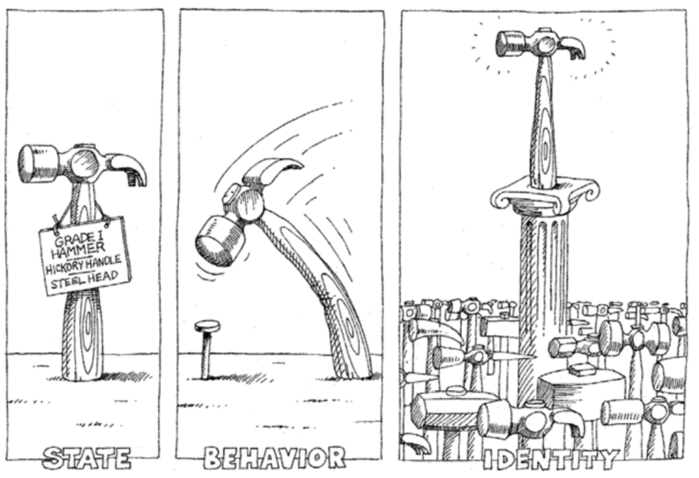

## Basics of Object Oriented Programming

<!-- 活在当下的程序员应该都听过“面向对象编程”一词，也经常有人问能不能用一句话解释下什么是“面向对象编程”，我们先来看看比较正式的说法。 -->

Every developer should've heard "Object Oriented Programming" before, and lots of people ask whether it can be explained using one sentence:

<!-- > 把一组数据结构和处理它们的方法组成对象（object），把相同行为的对象归纳为类（class），通过类的封装（encapsulation）隐藏内部细节，通过继承（inheritance）实现类的特化（specialization）和泛化（generalization），通过多态（polymorphism）实现基于对象类型的动态分派。 -->

> Object Oriented Programming is a programming paradigm based on the concept of "objects", which can contain data, in the form of fields, and code, in the form of methods. 

<!-- 这样一说是不是更不明白了。所以我们还是看看更通俗易懂的说法，下面这段内容来自于[知乎](https://www.zhihu.com/)。 -->

I find this description making the concept a lot more confusing if you haven't learned about programming before, so let's expand on it:

<!-- > **Note：** 以上的内容来自于网络，不代表作者本人的观点和看法，与作者本人立场无关，相关责任不由作者承担。 -->


> **Disclaimer:** The content above came from the internet, it does not represent the author's point of view. 

<!-- 之前我们说过“程序是指令的集合”，我们在程序中书写的语句在执行时会变成一条或多条指令然后由CPU去执行。当然为了简化程序的设计，我们引入了函数的概念，把相对独立且经常重复使用的代码放置到函数中，在需要使用这些功能的时候只要调用函数即可；如果一个函数的功能过于复杂和臃肿，我们又可以进一步将函数继续切分为子函数来降低系统的复杂性。但是说了这么多，不知道大家是否发现，所谓编程就是程序员按照计算机的工作方式控制计算机完成各种任务。但是，计算机的工作方式与正常人类的思维模式是不同的，如果编程就必须得抛弃人类正常的思维方式去迎合计算机，编程的乐趣就少了很多，“每个人都应该学习编程”这样的豪言壮语就只能说说而已。当然，这些还不是最重要的，最重要的是当我们需要开发一个复杂的系统时，代码的复杂性会让开发和维护工作都变得举步维艰，所以在上世纪60年代末期，“[软件危机](https://zh.wikipedia.org/wiki/%E8%BD%AF%E4%BB%B6%E5%8D%B1%E6%9C%BA)”、“[软件工程](https://zh.wikipedia.org/wiki/%E8%BD%AF%E4%BB%B6%E5%B7%A5%E7%A8%8B)”等一系列的概念开始在行业中出现。 -->

We mentioned that a program is a collection of tasks that are executed by the CPU. To simplify the program, we introduced the concept of functions, to encapsulate repeated code. If a function gets complicated, we can split them or nest them to enhance readability. Programming is essentially developers controlling computer in computer's way. But computers operate differently than how we humans think, therefore to develop a program, we need to think like a computer, which isn't really fun at all. Most importantly, when we need to develope a complex system, the complexity of the code makes development and maintenance very difficult. Therefore in the 1960s, concepts such as [Software Crisis](https://en.wikipedia.org/wiki/Software_crisis) and [Software Engineering](https://en.wikipedia.org/wiki/Software_engineering) emerged. 

<!-- 当然，程序员圈子内的人都知道，现实中并没有解决上面所说的这些问题的“[银弹](https://zh.wikipedia.org/wiki/%E6%B2%A1%E6%9C%89%E9%93%B6%E5%BC%B9)”，真正让软件开发者看到希望的是上世纪70年代诞生的[Smalltalk](https://zh.wikipedia.org/wiki/Smalltalk)编程语言中引入的面向对象的编程思想（面向对象编程的雏形可以追溯到更早期的[Simula](https://zh.wikipedia.org/wiki/Simula)语言）。按照这种编程理念，程序中的数据和操作数据的函数是一个逻辑上的整体，我们称之为“对象”，而我们解决问题的方式就是创建出需要的对象并向对象发出各种各样的消息，多个对象的协同工作最终可以让我们构造出复杂的系统来解决现实中的问题。 -->

Of course, we all know there is [no silver bullet](https://en.wikipedia.org/wiki/No_Silver_Bullet) to the problems mentioned above. In the 1970s, a language called [Smalltalk](https://en.wikipedia.org/wiki/Smalltalk) was introduced with the concept of object oriented programming. Essentially, the data and functions that manipuate those data is a logical unit, which we call an object. To solve a problem, we create objects that defines that problem and send request signals to it. Multiple objects can be combined and interact with each other to solve real-world complex problems. 
<!-- 
> **说明：** 当然面向对象也不是解决软件开发中所有问题的最后的“银弹”，所以今天的高级程序设计语言几乎都提供了对多种编程范式的支持，Python也不例外。 -->

> **Note：** Of course, objects are not a silver bullet that can solve all problems, therefore most of the high level programming languages nowadays provide support for multiple programming paradigms. 

### Class

Simply put, a class is a blueprint and an object is the implementation of that class. We can see from this definition that a class is an arbitrary definition, and an object is a realistic implementation. Every object is unique, with its own unique properties and behavior. Class is an extraction of similar properties (static properties) and behaviors (dynamic properties) of multiple objects. 

<!-- 简单的说，类是对象的蓝图和模板，而对象是类的实例。这个解释虽然有点像用概念在解释概念，但是从这句话我们至少可以看出，类是抽象的概念，而对象是具体的东西。在面向对象编程的世界中，一切皆为对象，对象都有属性和行为，每个对象都是独一无二的，而且对象一定属于某个类（型）。当我们把一大堆拥有共同特征的对象的静态特征（属性）和动态特征（行为）都抽取出来后，就可以定义出一个叫做“类”的东西。 -->



### Defining Class

In Python, we can use `class` keyword to define a class, and defining methods is very similar to defining functions. By defining methods, we define how objects behave. 

<!-- 在Python中可以使用`class`关键字定义类，然后在类中通过之前学习过的函数来定义方法，这样就可以将对象的动态特征描述出来，代码如下所示。 -->
```Python
class Student(object):

    # __init__ is a class constructor, it is used when we initialize an object
    # using the __init__ method, we can take in 2 parameters and bind the data from user to the object that is instantiated
    def __init__(self, name, age):
        self.name = name
        self.age = age

    def study(self, course_name):
        print('%sis studying %s.' % (self.name, course_name))

    # PEP_8 is a python style guideline, that requires words to be connected using underscore
    # but most developers prefer camel case
    def watch_movie(self):
        if self.age < 18:
            print('%s cannot watch R-rated movies.' % self.name)
        else:
            print('%s can watch whatever you want' % self.name)
```

<!-- > **说明：** 写在类中的函数，我们通常称之为（对象的）方法，这些方法就是对象可以接收的消息。 -->
> **Note:** Functions that are written inside a class like above are called instance methods. These methods allow interaction between outside world and the object. Each method is bound to the object that instantiate from this class. 

### Creating and using objects

<!-- 当我们定义好一个类之后，可以通过下面的方式来创建对象并给对象发消息。 -->
After we defined a class, we can use the following syntax to create objects and use their methods

```Python
def main():
    # Creating a student and specifying name and age
    stu1 = Student('Michael', 38)
    # sending a studying message
    stu1.study('Python')
    # printing a watch movie message
    stu1.watch_movie()
    stu2 = Student('Jack', 15)
    stu2.study('Java')
    stu2.watch_movie()


if __name__ == '__main__':
    main()
```


### Access level for class fields

<!-- 对于上面的代码，有C++、Java、C#等编程经验的程序员可能会问，我们给`Student`对象绑定的`name`和`age`属性到底具有怎样的访问权限（也称为可见性）。因为在很多面向对象编程语言中，我们通常会将对象的属性设置为私有的（private）或受保护的（protected），简单的说就是不允许外界访问，而对象的方法通常都是公开的（public），因为公开的方法就是对象能够接受的消息。在Python中，属性和方法的访问权限只有两种，也就是公开的和私有的，如果希望属性是私有的，在给属性命名时可以用两个下划线作为开头，下面的代码可以验证这一点。 -->

For the code above, C++, Java, and C# developers may ask, what kind of access level does `name` and `age` field has for the `Student` class? Because in many strongly typed programming languages, usually we make a class field private or protected, which prevents the outside world from directly accessing and modifying them. Instance methods are usually public, which can be accessed by the outside world. In Python, there are two types of access levels: private and public. To make a field private, add 2 underscores in front of the field name:

```Python
class Test:

    def __init__(self, foo):
        self.__foo = foo

    def __bar(self):
        print(self.__foo)
        print('__bar')


def main():
    test = Test('hello')
    # AttributeError: 'Test' object has no attribute '__bar'
    test.__bar()
    # AttributeError: 'Test' object has no attribute '__foo'
    print(test.__foo)


if __name__ == "__main__":
    main()
```

<!-- 但是，Python并没有从语法上严格保证私有属性或方法的私密性，它只是给私有的属性和方法换了一个名字来“妨碍”对它们的访问，事实上如果你知道更换名字的规则仍然可以访问到它们，下面的代码就可以验证这一点。之所以这样设定，可以用这样一句名言加以解释，就是“We are all consenting adults here”。因为绝大多数程序员都认为开放比封闭要好，而且程序员要自己为自己的行为负责。 -->

Technically, Python doesn't guarantee the private access of a class field, you can still access them if you know how, which is demonstrated in the code below. Python assumes that as a developer, you won't be modifying field in a wrongful manner. 

```Python
class Test:

    def __init__(self, foo):
        self.__foo = foo

    def __bar(self):
        print(self.__foo)
        print('__bar')


def main():
    test = Test('hello')
    test._Test__bar()
    print(test._Test__foo)


if __name__ == "__main__":
    main()
```
<!-- 
在实际开发中，我们并不建议将属性设置为私有的，因为这会导致子类无法访问（后面会讲到）。所以大多数Python程序员会遵循一种命名惯例就是让属性名以单下划线开头来表示属性是受保护的，本类之外的代码在访问这样的属性时应该要保持慎重。这种做法并不是语法上的规则，单下划线开头的属性和方法外界仍然是可以访问的，所以更多的时候它是一种暗示或隐喻，关于这一点可以看看我的[《Python - 那些年我们踩过的那些坑》](http://blog.csdn.net/jackfrued/article/details/79521404)文章中的讲解。 -->

In actual development, we don't recommend making a field private, as it may cause access problems for child classes that inherits (will be mentioned later) the parent class. Therefore most developers will put a single underscore in front of the field name, indicating it is protected, and should be carefully accessed by the outside world code. 

### Pillars of Object Oriented Programming

<!-- 面向对象有三大支柱：封装、继承和多态。后面两个概念在下一个章节中进行详细的说明，这里我们先说一下什么是封装。我自己对封装的理解是“隐藏一切可以隐藏的实现细节，只向外界暴露（提供）简单的编程接口”。我们在类中定义的方法其实就是把数据和对数据的操作封装起来了，在我们创建了对象之后，只需要给对象发送一个消息（调用方法）就可以执行方法中的代码，也就是说我们只需要知道方法的名字和传入的参数（方法的外部视图），而不需要知道方法内部的实现细节（方法的内部视图）。 -->

Object Oriented Programming has 4 pillars: Encapsulation, Abstraction, Inheritance and Polymorphism. Inheritance and Polymorphism will be talked about in later chapters, but let's first understand what is encapsulation. The idea of encapsulation is to hide the state and values of a structured data object inside a class, only exposing methods (so called getters and setters) to the public for access or modification. This prevents unauthorized access from outside parties. In our example above, defining class is essentially encapsulation of data and methods. After creating an object with that class, we are using public exposed methods to access the object instance. In other words, we know how to call the instance method, the kind of data we need to pass in, and the return of the method, but we don't know anything about internal implementation details. 

### Exercise

#### Exercise1：Defining a clock

```Python
from time import sleep


class Clock(object):
    """Digital Clock"""

    # By setting default values for the constructor, we can instantiate a clock without actually passing in the hour, minute or second
    def __init__(self, hour=0, minute=0, second=0):
        """Constructor

        :param hour
        :param minute
        :param second
        """
        self._hour = hour
        self._minute = minute
        self._second = second

    def run(self):
        self._second += 1
        if self._second == 60:
            self._second = 0
            self._minute += 1
            if self._minute == 60:
                self._minute = 0
                self._hour += 1
                if self._hour == 24:
                    self._hour = 0

    def show(self):
        """Display time"""
        return '%02d:%02d:%02d' % \
               (self._hour, self._minute, self._second)


def main():
    clock = Clock(23, 59, 58)
    while True:
        print(clock.show())
        sleep(1)
        clock.run()


if __name__ == '__main__':
    main()
```

<!-- #### 练习2：定义一个类描述平面上的点并提供移动点和计算到另一个点距离的方法。 -->
#### Exercise2：Defining a point on a plane and calculate the distance to another point

```Python
from math import sqrt


class Point(object):

    def __init__(self, x=0, y=0):
        """
        
        :param x: x-axis
        :param y: y-axis
        """
        self.x = x
        self.y = y

    def move_to(self, x, y):
        """Move to another point
        
        :param x: new x-axis
        "param y: new y-axis
        """
        self.x = x
        self.y = y

    def move_by(self, dx, dy):
        """relative move
        
        :param dx: move to x + dx
        "param dy: move to y + dy
        """
        self.x += dx
        self.y += dy

    def distance_to(self, other):
        """calculating the distance from 1 point to another using trig 
        
        :param other: another point
        """
        dx = self.x - other.x
        dy = self.y - other.y
        return sqrt(dx ** 2 + dy ** 2)

    def __str__(self):
        return '(%s, %s)' % (str(self.x), str(self.y))


def main():
    p1 = Point(3, 5)
    p2 = Point()
    print(p1)
    print(p2)
    p2.move_by(-1, 2)
    print(p2)
    print(p1.distance_to(p2))


if __name__ == '__main__':
    main()
```

<!-- > **说明：** 本章中的插图来自于Grady Booch等著作的[《面向对象分析与设计》](https://item.jd.com/20476561918.html)一书，该书是讲解面向对象编程的经典著作，有兴趣的读者可以购买和阅读这本书来了解更多的面向对象的相关知识。 -->


> **Note：** The pictures from this chapter came from the book by Grady Booch [Object-Oriented Analysis and Design with Applications](https://www.amazon.ca/Object-Oriented-Analysis-Design-Applications-3rd/dp/020189551X), which is a staple book that talks about object oriented programming. 