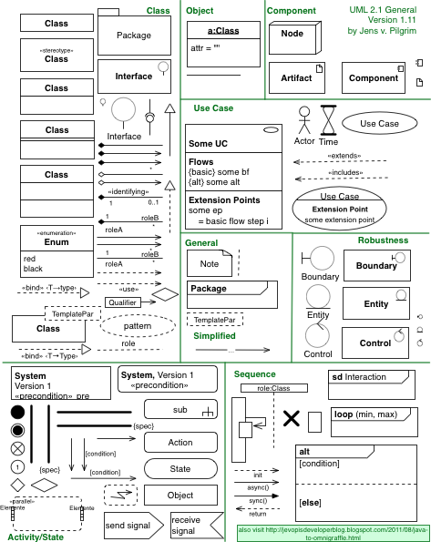

<!-- ## 面向对象进阶 -->
## Advanced OOP

<!-- 在前面的章节我们已经了解了面向对象的入门知识，知道了如何定义类，如何创建对象以及如何给对象发消息。为了能够更好的使用面向对象编程思想进行程序开发，我们还需要对Python中的面向对象编程进行更为深入的了解。 -->

In the previous chapter, we talked about the basics of Object Oriented Programming. More specifically, how to define a class, instantiate an object, and accessing the class methods.

### @property decorator

Before we talked about the problem with access modifier for class attributes. Although we don't recommend setting a field as private, exposing them directly to the outside world is also problematic. For example, we don't have a way to check whether the given value for a field is valid. Getters and setters can be used to access and modify fields that are protected, and we can use `@property` like the code below:

<!-- 之前我们讨论过Python中属性和方法访问权限的问题，虽然我们不建议将属性设置为私有的，但是如果直接将属性暴露给外界也是有问题的，比如我们没有办法检查赋给属性的值是否有效。我们之前的建议是将属性命名以单下划线开头，通过这种方式来暗示属性是受保护的，不建议外界直接访问，那么如果想访问属性可以通过属性的getter（访问器）和setter（修改器）方法进行对应的操作。如果要做到这点，就可以考虑使用@property包装器来包装getter和setter方法，使得对属性的访问既安全又方便，代码如下所示。 -->

```Python
class Person(object):

    def __init__(self, name, age):
        self._name = name
        self._age = age

    # getter
    @property
    def name(self):
        return self._name

    # getter
    @property
    def age(self):
        return self._age

    # setter for age
    @age.setter
    def age(self, age):
        self._age = age

    def play(self):
        if self._age <= 16:
            print('%s is younger than 16 years old' % self._name)
        else:
            print('%s is older than 16' % self._name)


def main():
    person = Person('王大锤', 12)
    person.play()
    person.age = 22
    person.play()
    # person.name = 'Something new'  # AttributeError: can't set attribute


if __name__ == '__main__':
    main()
```

### \_\_slots\_\_ Magic

<!-- 我们讲到这里，不知道大家是否已经意识到，Python是一门[动态语言](https://zh.wikipedia.org/wiki/%E5%8A%A8%E6%80%81%E8%AF%AD%E8%A8%80)。通常，动态语言允许我们在程序运行时给对象绑定新的属性或方法，当然也可以对已经绑定的属性和方法进行解绑定。但是如果我们需要限定自定义类型的对象只能绑定某些属性，可以通过在类中定义\_\_slots\_\_变量来进行限定。需要注意的是\_\_slots\_\_的限定只对当前类的对象生效，对子类并不起任何作用。 -->

Python is a [dynamic programming language](https://en.wikipedia.org/wiki/Dynamic_programming_language). It allows us to bind and unbind new fields or methods to an object during program runtime. But if we want to limit the attributes that can be bind to, we can define a `__slot__` attribute when defining the class. Note that `__slot__` only works for the class it is defined in, not for any child classes. 

```Python
class Person(object):

    # limit Person object can only bind _name, _age and _gender attributes
    __slots__ = ('_name', '_age', '_gender')

    def __init__(self, name, age):
        self._name = name
        self._age = age

    @property
    def name(self):
        return self._name

    @property
    def age(self):
        return self._age

    @age.setter
    def age(self, age):
        self._age = age

    def play(self):
        if self._age <= 16:
            print('%s is younger than 16 years old' % self._name)
        else:
            print('%s is older than 16' % self._name)


def main():
    person = Person('王大锤', 22)
    person.play()
    person._gender = 'M'
    # AttributeError: 'Person' object has no attribute '_occupation'
    # person._occupation = 'Engineer'
```

>**Note:** \_\_slots\_\_ is recommended for classes that you know will have a defined set of attributes. Under the hood, it tells Python to not use dictionary to store attributes, instead a set amount of memory will be allocated for these attributes. Not using \_\_slots\_\_ will let Python store attributes in dictionaries, which means lots of memory will be used when millions of objects are created. 

### Static and Class Methods

<!-- 之前，我们在类中定义的方法都是对象方法，也就是说这些方法都是发送给对象的消息。实际上，我们写在类中的方法并不需要都是对象方法，例如我们定义一个“三角形”类，通过传入三条边长来构造三角形，并提供计算周长和面积的方法，但是传入的三条边长未必能构造出三角形对象，因此我们可以先写一个方法来验证三条边长是否可以构成三角形，这个方法很显然就不是对象方法，因为在调用这个方法时三角形对象尚未创建出来（因为都不知道三条边能不能构成三角形），所以这个方法是属于三角形类而并不属于三角形对象的。我们可以使用静态方法来解决这类问题，代码如下所示。 -->

Static methods are bound to a class instead of the objects that are instantiated from that class. All methods we wrote before are bound to objects, but they don't have to be. For example, if we define a triangle class, give it length of 3 sides to construct it. We want to write a method to validate the input first, before the object is instantiated. Therefore this method is bound to the triangle class itself, instead of individual objects that are created. Static methods therefore cannot modify the state of an object.

```Python
from math import sqrt


class Triangle(object):

    def __init__(self, a, b, c):
        self._a = a
        self._b = b
        self._c = c

    @staticmethod
    def is_valid(a, b, c):
        return a + b > c and b + c > a and a + c > b

    def perimeter(self):
        return self._a + self._b + self._c

    def area(self):
        half = self.perimeter() / 2
        return sqrt(half * (half - self._a) *
                    (half - self._b) * (half - self._c))


def main():
    a, b, c = 3, 4, 5
    if Triangle.is_valid(a, b, c):
        t = Triangle(a, b, c)
        print(t.perimeter())
        # print(Triangle.perimeter(t))
        print(t.area())
        # print(Triangle.area(t))
    else:
        print('Cannot create triangle.')


if __name__ == '__main__':
    main()
```
Class methods are NOT the same as instance methods. Class methods know about the class itself, therefore the first parameter passed into the function is named `cls`, which contains relevant information regarding the current class. The code below uses class method to limit the constructor usage. 

<!-- 和静态方法比较类似，Python还可以在类中定义类方法，类方法的第一个参数约定名为cls，它代表的是当前类相关的信息的对象（类本身也是一个对象，有的地方也称之为类的元数据对象），通过这个参数我们可以获取和类相关的信息并且可以创建出类的对象，代码如下所示。 -->

```Python
from time import time, localtime, sleep


class Clock(object):

    def __init__(self, hour=0, minute=0, second=0):
        self._hour = hour
        self._minute = minute
        self._second = second

    @classmethod
    def now(cls):
        ctime = localtime(time())
        return cls(ctime.tm_hour, ctime.tm_min, ctime.tm_sec)

    def run(self):
        self._second += 1
        if self._second == 60:
            self._second = 0
            self._minute += 1
            if self._minute == 60:
                self._minute = 0
                self._hour += 1
                if self._hour == 24:
                    self._hour = 0

    def show(self):
        return '%02d:%02d:%02d' % \
               (self._hour, self._minute, self._second)


def main():
    clock = Clock.now()
    while True:
        print(clock.show())
        sleep(1)
        clock.run()


if __name__ == '__main__':
    main()
```

### Relationships between classes

<!-- 简单的说，类和类之间的关系有三种：is-a、has-a和use-a关系。

- is-a关系也叫继承或泛化，比如学生和人的关系、手机和电子产品的关系都属于继承关系。
- has-a关系通常称之为关联，比如部门和员工的关系，汽车和引擎的关系都属于关联关系；关联关系如果是整体和部分的关联，那么我们称之为聚合关系；如果整体进一步负责了部分的生命周期（整体和部分是不可分割的，同时同在也同时消亡），那么这种就是最强的关联关系，我们称之为合成关系。
- use-a关系通常称之为依赖，比如司机有一个驾驶的行为（方法），其中（的参数）使用到了汽车，那么司机和汽车的关系就是依赖关系。

我们可以使用一种叫做[UML](https://zh.wikipedia.org/wiki/%E7%BB%9F%E4%B8%80%E5%BB%BA%E6%A8%A1%E8%AF%AD%E8%A8%80)（统一建模语言）的东西来进行面向对象建模，其中一项重要的工作就是把类和类之间的关系用标准化的图形符号描述出来。关于UML我们在这里不做详细的介绍，有兴趣的读者可以自行阅读[《UML面向对象设计基础》](https://e.jd.com/30392949.html)一书。 -->

Simply speaking, there are 3 kind of relationships for classes: is-a, has-a and use-a. 

- is-a relationship also represents subclasses. For example, class A is a subclass of class B. One class is obtaining the features of another class by using inheritance
- has-a is a composition relationship where one object belongs to (is part or member of) another object. An object of one class is created as data member in another class.
- If class B uses class A in one of its methods, then this relationship is a use-a relationship. 

We can use something called [UML](https://en.wikipedia.org/wiki/Unified_Modeling_Language) (Unified Modeling Language) to visualize the design of a software system. 




<!-- 利用类之间的这些关系，我们可以在已有类的基础上来完成某些操作，也可以在已有类的基础上创建新的类，这些都是实现代码复用的重要手段。复用现有的代码不仅可以减少开发的工作量，也有利于代码的管理和维护，这是我们在日常工作中都会使用到的技术手段。 -->

By leveraging class relationships, we can use existing classes for additional operations, such as creating new classes based on existing ones, which can be very handy for code reusing. DRY (Don't repeat yourself) principal, as mentioned again and again, is essential for easy readability and maintainable. 

<!-- ### 继承和多态 -->
### Inheritance and Polymorphism

<!-- 刚才我们提到了，可以在已有类的基础上创建新类，这其中的一种做法就是让一个类从另一个类那里将属性和方法直接继承下来，从而减少重复代码的编写。提供继承信息的我们称之为父类，也叫超类或基类；得到继承信息的我们称之为子类，也叫派生类或衍生类。子类除了继承父类提供的属性和方法，还可以定义自己特有的属性和方法，所以子类比父类拥有的更多的能力，在实际开发中，我们经常会用子类对象去替换掉一个父类对象，这是面向对象编程中一个常见的行为，对应的原则称之为[里氏替换原则](https://zh.wikipedia.org/wiki/%E9%87%8C%E6%B0%8F%E6%9B%BF%E6%8D%A2%E5%8E%9F%E5%88%99)。下面我们先看一个继承的例子。 -->

We mentioned that one way of creating new classes based on existing classes can be done using the idea of inheritance. The parent or base class is the existing class that provides data. The newly created class, or child class inherits data or methods from the parent class. But at the same time, the child class can also define its own methods and fields. In actual development, we often use child objects to substitute for a parent object, which uses the [Liskov substitution principle](https://en.wikipedia.org/wiki/Liskov_substitution_principle). The code below demonstrates how we can use inheritance in Python:


```Python
class Person(object):

    def __init__(self, name, age):
        self._name = name
        self._age = age

    @property
    def name(self):
        return self._name

    @property
    def age(self):
        return self._age

    @age.setter
    def age(self, age):
        self._age = age

    def play(self):
        print('%s is playing' % self._name)

    def is_of_age(self):
        if self._age >= 18:
            print('%s is older than 18' % self._name)
        else:
            print('%s is still a kid' % self._name)

# the student class inherits from the Person class
class Student(Person):
    # Student class automatically has name and age field
    def __init__(self, name, age, grade):
        # in Python, we can use the parent class method by using super()
        super().__init__(name, age)
        self._grade = grade

    @property
    def grade(self):
        return self._grade

    @grade.setter
    def grade(self, grade):
        self._grade = grade

    def study(self, course):
        print('Grade %s student %s is studying %s' % (self._grade, self.name, course))


class Teacher(Person):

    def __init__(self, name, age, title):
        super().__init__(name, age)
        self._title = title

    @property
    def title(self):
        return self._title

    @title.setter
    def title(self, title):
        self._title = title

    def teach(self, course):
        print('%s %s is teaching %s' % (self._title, self._name, course))


def main():
    stu = Student('Michael', 15, '8')
    stu.study('Math')
    stu.is_of_age()
    t = Teacher('骆昊', 38, 'Professor')
    t.teach('Python')
    t.is_of_age()


if __name__ == '__main__':
    main()
```

<!-- 子类在继承了父类的方法后，可以对父类已有的方法给出新的实现版本，这个动作称之为方法重写（override）。通过方法重写我们可以让父类的同一个行为在子类中拥有不同的实现版本，当我们调用这个经过子类重写的方法时，不同的子类对象会表现出不同的行为，这个就是多态（poly-morphism）。 -->

When child class inherits from a parent class, it not only gains access to parent class method, but it can also override that method by providing a different implementation. This allows the same method to have different behavior in different child objects. This concept is called polymorphism. 

```Python
from abc import ABCMeta, abstractmethod


class Pet(object, metaclass=ABCMeta):

    def __init__(self, nickname):
        self._nickname = nickname

    @abstractmethod
    def make_noise(self):
        pass


class Dog(Pet):

    def make_noise(self):
        print('%s: bark...' % self._nickname)


class Cat(Pet):

    def make_noise(self):
        print('%s: meow...' % self._nickname)


def main():
    pets = [Dog('旺财'), Cat('凯蒂'), Dog('大黄')]
    for pet in pets:
        pet.make_noise()


if __name__ == '__main__':
    main()
```

<!-- 在上面的代码中，我们将`Pet`类处理成了一个抽象类，所谓抽象类就是不能够创建对象的类，这种类的存在就是专门为了让其他类去继承它。Python从语法层面并没有像Java或C#那样提供对抽象类的支持，但是我们可以通过`abc`模块的`ABCMeta`元类和`abstractmethod`包装器来达到抽象类的效果，如果一个类中存在抽象方法那么这个类就不能够实例化（创建对象）。上面的代码中，`Dog`和`Cat`两个子类分别对`Pet`类中的`make_voice`抽象方法进行了重写并给出了不同的实现版本，当我们在`main`函数中调用该方法时，这个方法就表现出了多态行为（同样的方法做了不同的事情）。 -->

In above code, we defined class `Pet` as an abstract class. An abstract class is a blueprint for other classes, it is defined with the purpose of being inherited by other classes. Python does not have built-in support for abstract classes like Java or C#, therefore we had to import from `abc` module. For more on this module, check out the API Doc at https://docs.python.org/3/library/abc.html. 

The abstract class defines a set of abstract methods, in the Pet class, there is a `make_noise` method. However, notice it is not actually implemented in the `Pet` class, instead it is implemented differently in `Dog` and `Cat` classes. Abstract class requires all child classes that inherits it to implement the abstract methods being defined, but allows different implementations for each child class. Which is why in the code above, the outputs from the same method `make_noise` from a `Dog` object and `Cat` are different. This effectively realizes the concept of polymorphism. 

To learn more about the concept of abstract class, read this tutorial about abstract classes in Java:
https://www.javatpoint.com/abstract-class-in-java

### Examples

#### Example1：Ultraman

```Python
from abc import ABCMeta, abstractmethod
from random import randint, randrange


class Fighter(object, metaclass=ABCMeta):

    # using __slots__ we can define the fields in this abstract class
    __slots__ = ('_name', '_hp')

    def __init__(self, name, hp):
        self._name = name
        self._hp = hp

    @property
    def name(self):
        return self._name

    @property
    def hp(self):
        return self._hp

    @hp.setter
    def hp(self, hp):
        self._hp = hp if hp >= 0 else 0

    @property
    def alive(self):
        return self._hp > 0

    @abstractmethod
    def attack(self, other):
        """

        :param other: Object being attacked
        """
        pass


class Ultraman(Fighter):
    

    __slots__ = ('_name', '_hp', '_mp')

    def __init__(self, name, hp, mp):
        # calling parent class init to initialize name and hp
        super().__init__(name, hp)
        self._mp = mp

    def attack(self, other):
        other.hp -= randint(15, 25)

    def huge_attack(self, other):
        """
            Ultimate (decrement at least 50 hp or 3/4 of hp)

        :param other: object being attacked

        :return: return whether the ultimate was successful
        """
        if self._mp >= 50:
            self._mp -= 50
            injury = other.hp * 3 // 4
            injury = injury if injury >= 50 else 50
            other.hp -= injury
            return True
        else:
            self.attack(other)
            return False

    def magic_attack(self, others):
        """
        :return: Whether the magic attack was performed
        """
        if self._mp >= 20:
            self._mp -= 20
            for temp in others:
                if temp.alive:
                    temp.hp -= randint(10, 15)
            return True
        else:
            return False

    def resume(self):
        """get more mp"""
        incr_point = randint(1, 10)
        self._mp += incr_point
        return incr_point

    def __str__(self):
        # __str__ is a special method, having this method in a class allows us to simply call print(object)
        # the output would be what is shown in the __str__ method
        # If we don't have this method, print(object) will print out the memory location of the object
        return '~~~%sUltraman~~~\n' % self._name + \
            'HP: %d\n' % self._hp + \
            'MP: %d\n' % self._mp


class Monster(Fighter):

    __slots__ = ('_name', '_hp')

    def attack(self, other):
        other.hp -= randint(10, 20)

    def __str__(self):
        return '~~~%s Monster~~~\n' % self._name + \
            'HP: %d\n' % self._hp


def is_any_alive(monsters):
    """Check if any monster is alive"""
    # notice Monster class does not have alive method, the alive method is in the Fighter class
    # but since Monster inherits it, it can be called for any Monster object
    # the alive method actually returns a Boolean True or False
    # But in Python, False == 0
    # Technically, we can just write if monster.alive:
    for monster in monsters:
        if monster.alive > 0:
            return True
    return False


def select_alive_one(monsters):
    # Randomly select a live monster
    monsters_len = len(monsters)
    while True:
        index = randrange(monsters_len)
        monster = monsters[index]
        if monster.alive > 0:
            return monster


def display_info(ultraman, monsters):
    print(ultraman)
    for monster in monsters:
        print(monster, end='')


def main():
    u = Ultraman('One', 1000, 120)
    m1 = Monster('Two', 250)
    m2 = Monster('Three', 500)
    m3 = Monster('Four', 750)
    ms = [m1, m2, m3]
    fight_round = 1
    while u.alive and is_any_alive(ms):
        # %02d means this is a placeholder for a number, 02 means we want 2 digit number
        print('========Round %02d========' % fight_round)
        m = select_alive_one(ms) 
        skill = randint(1, 10)   # Randomly uses a skill
        if skill <= 6:  # 60% chance of using a normal attack
            print('%s attacked %s.' % (u.name, m.name))
            u.attack(m)
            print('%s recovered %d mp' % (u.name, u.resume()))
        elif skill <= 9:  # 30% chance of using magic attack, may fail due to insufficient mp
            if u.magic_attack(ms):
                print('%s used magic attack' % u.name)
            else:
                print('%s magic attack failed' % u.name)
        else:  # 10% chance of using ultimate, if insufficient mp, use normal attack
            if u.huge_attack(m):
                print('%s used ultimate on %s.' % (u.name, m.name))
            else:
                print('%s used normal attack on %s.' % (u.name, m.name))
                print('%s recovered %d mp' % (u.name, u.resume()))
        if m.alive > 0:  # if selected monster is alive, attack ultraman
            print('%s attacked %s.' % (m.name, u.name))
            m.attack(u)
        display_info(u, ms)  # display stats for ultraman and monster at every round
        fight_round += 1
    print('\n========Round Finished!========\n')
    if u.alive > 0:
        print('%s won!' % u.name)
    else:
        print('Monsters won!')


if __name__ == '__main__':
    main()
```

#### Example2：Card Game

```Python
import random


class Card(object):
    """One single card, has suit and a number"""

    def __init__(self, suit, number):
        self._suit = suit
        self._number = number

    @property
    def number(self):
        return self._number

    @property
    def suit(self):
        return self._suit

    def __str__(self):
        if self._number == 1:
            number_str = 'A'
        elif self._number == 11:
            number_str = 'J'
        elif self._number == 12:
            number_str = 'Q'
        elif self._number == 13:
            number_str = 'K'
        else:
            number_str = str(self._number)
        return '%s%s' % (self._suit, number_str)
    
    def __repr__(self):
        # __repr__ is used mainly for developers
        # When directly calling the object, __repr__is called
        # __str__ is called when print(object)
        # For more difference, check out https://stackoverflow.com/questions/1436703/difference-between-str-and-repr
        return self.__str__()


class Poker(object):
    """A deck of card"""

    def __init__(self):
        # this is a list comprehension that creates a list of Card object
        self._cards = [Card(suit, number) 
                       for suit in '♠♥♣♦'
                       for number in range(1, 14)]
        self._current = 0

    @property
    def cards(self):
        return self._cards

    def shuffle(self):
        self._current = 0
        random.shuffle(self._cards)

    @property
    def next(self):
        """deal a card"""
        card = self._cards[self._current]
        self._current += 1
        return card

    @property
    def has_next(self):
        return self._current < len(self._cards)


class Player(object):
    def __init__(self, name):
        self._name = name
        self._cards_on_hand = []

    @property
    def name(self):
        return self._name

    @property
    def cards_on_hand(self):
        return self._cards_on_hand

    def get(self, card):
        self._cards_on_hand.append(card)

    def arrange(self, card_key):
        """arrange cards by key"""
        self._cards_on_hand.sort(key=card_key)


def get_key(card):
    return (card.suit, card.number)


def main():
    p = Poker()
    p.shuffle()
    players = [Player('One'), Player('Two'), Player('Three'), Player('Four')]
    for _ in range(13):
        for player in players:
            player.get(p.next)
    for player in players:
        print(player.name + ':', end=' ')
        player.arrange(get_key)
        print(player.cards_on_hand)


if __name__ == '__main__':
    main()
```

<!-- >**说明：** 大家可以自己尝试在上面代码的基础上写一个简单的扑克游戏，例如21点(Black Jack)，游戏的规则可以自己在网上找一找。 -->

>**Note：** Using above code, you can try to write a simple poker game such as Black Jack. 

<!-- #### 案例3：工资结算系统 -->
#### Example3：Salary Calculation

```Python
"""

There are 3 types of employee: manager, developer and sales
We need to design a salary calculation system. to calculate monthly salary for employee
Manager has a set salary of 15k per month
Developers has an hourly rate of 150/hr
Sales has base monthly salary of 1.2k + 5% commission
"""
from abc import ABCMeta, abstractmethod


class Employee(object, metaclass=ABCMeta):
    """Employee"""

    def __init__(self, name):

        self._name = name

    @property
    def name(self):
        return self._name

    @abstractmethod
    def get_salary(self):
        pass


class Manager(Employee):
    def get_salary(self):
        return 15000.0


class Programmer(Employee):
    def __init__(self, name, working_hour=0):
        super().__init__(name)
        self._working_hour = working_hour

    @property
    def working_hour(self):
        return self._working_hour

    @working_hour.setter
    def working_hour(self, working_hour):
        self._working_hour = working_hour if working_hour > 0 else 0

    def get_salary(self):
        return 150.0 * self._working_hour


class Salesman(Employee):

    def __init__(self, name, sales=0):
        super().__init__(name)
        self._sales = sales

    @property
    def sales(self):
        return self._sales

    @sales.setter
    def sales(self, sales):
        self._sales = sales if sales > 0 else 0

    def get_salary(self):
        return 1200.0 + self._sales * 0.05


def main():
    emps = [
        Manager('刘备'), Programmer('诸葛亮'),
        Manager('曹操'), Salesman('荀彧'),
        Salesman('吕布'), Programmer('张辽'),
        Programmer('赵云')
    ]
    for emp in emps:
        # we can use isinstance method to check the object type of a variable
        if isinstance(emp, Programmer):
            emp.working_hour = int(input('Please enter hours for %s: ' % emp.name))
        elif isinstance(emp, Salesman):
            emp.sales = float(input('Please enter total sales for %s: ' % emp.name))
        # all variables will call get_salary method, but will trigger different behavior
        print('%s will receive salary of %s' %
              (emp.name, emp.get_salary()))


if __name__ == '__main__':
    main()
```
